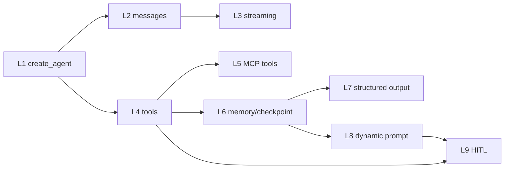

# L1-L9 OpenCode 导师学习计划

对应项目：`D:\Desktop\code\ai_study\lca-langchainV1-essentials`

适用对象：已经能运行 Python notebook，但还没有把 LangChain / LangGraph agent 工程链路讲透、改透、测透的学习者。

交付目标：让 OpenCode 作为导师，按阶段带学习者完成从入门、理解、复盘、实战到多轮测试的闭环。学习结束后，学习者应能独立解释并改造一个带工具、状态、结构化输出、动态提示词和 HITL 审批的 agent demo。

## OpenCode 导师总提示词

把下面这段交给 OpenCode，作为本项目学习导师的工作协议。

```text
你是这个项目的 LangChain / LangGraph 学习导师。

项目路径：
D:\Desktop\code\ai_study\lca-langchainV1-essentials

教学目标：
带我从 L1 到 L9 掌握这个项目，不只是跑 notebook，而是能解释核心机制、修改练习代码、排查错误、回答面试追问，并最后完成实战项目与多轮测试。

导师规则：
1. 先读当前仓库文件，再教学，不要凭空讲通用 LangChain。
2. 每一课都按：目标 -> 文件定位 -> 机制解释 -> 代码走读 -> 动手练习 -> 提问检查 -> 小测评分。
3. 每次最多推进一个学习单元，不要一次灌太多。
4. 我答错时不要直接跳过，要指出错在哪里，并要求我用自己的话重答。
5. 每一阶段结束后进行一次综合测试，包括概念题、代码阅读题、排障题和小实战。
6. 不要随意修改项目文件。只有我明确说“开始实战修改”时，才可以改代码或 notebook。
7. 涉及 API 行为时，以当前项目依赖、notebook 代码和官方文档为准。
8. 重点训练我能把 notebook 学习项目讲成可信工程项目。

当前最重要的主线：
会聊天 -> 会调用工具 -> 会保留状态 -> 会输出结构化结果 -> 会按上下文调整行为 -> 高风险动作先人工审批
```

## 项目学习地图

### 第一轮：恢复主线，必须掌握

顺序：

1. `python/L1_fast_agent.ipynb`
2. `python/L4_tools.ipynb`
3. `python/L6_memory.ipynb`
4. `python/L8_dynamic.ipynb`
5. `python/L9_HITL.ipynb`

目标：

- 搭起 agent 工程骨架。
- 理解 `create_agent` 装配入口。
- 理解 tools、runtime context、checkpointer、middleware 的分工。
- 能解释为什么 L9 的 HITL 需要 checkpoint 和 `thread_id`。

### 第二轮：补齐输入输出能力，会用到但不多

顺序：

1. `python/L2_messages.ipynb`
2. `python/L3_streaming.ipynb`
3. `python/L7_structuredOutput.ipynb`

目标：

- 能读懂 agent 输入输出中的 `messages`。
- 能区分 `invoke`、`stream_mode="values"`、`stream_mode="messages"`。
- 能用 `response_format` 把自然语言输出约束成程序可消费的结构。

### 第三轮：了解外部工具与服务化，基本了解

顺序：

1. `python/L5_tools_with_mcp.ipynb`
2. `python/l5_local_mcp_server.py`
3. `python/studio/sql_agent1.py`
4. `python/studio/sql_agent2.py`
5. `python/studio/langgraph.json`

目标：

- 知道 MCP 是外部工具协议化接入方式。
- 知道 notebook demo 如何迁移到 LangGraph Studio。
- 能说出学习 demo 和生产服务之间缺哪些工程组件。

## 学习前置检查

### 文件定位

必须先确认这些文件存在：

- `README.md`
- `python/README.md`
- `python/pyproject.toml`
- `python/example.env`
- `python/env_utils.py`
- `python/Chinook.db`
- `python/L1_fast_agent.ipynb`
- `python/L2_messages.ipynb`
- `python/L3_streaming.ipynb`
- `python/L4_tools.ipynb`
- `python/L5_tools_with_mcp.ipynb`
- `python/L6_memory.ipynb`
- `python/L7_structuredOutput.ipynb`
- `python/L8_dynamic.ipynb`
- `python/L9_HITL.ipynb`
- `python/L1-L9_项目复习总纲.md`
- `python/L1-L9_面试官题库.md`

### 环境检查

推荐命令：

```powershell
cd D:\Desktop\code\ai_study\lca-langchainV1-essentials\python
uv sync
.\.venv\Scripts\python.exe -c "from env_utils import doublecheck_pkgs; doublecheck_pkgs('pyproject.toml', verbose=True)"
uv run jupyter lab
```

检查目标：

- Python 版本满足 `>=3.11,<3.14`。
- `langchain`、`langgraph`、`langchain-core`、`langchain-openai`、`langchain-community` 能导入。
- `.env` 已从 `example.env` 复制并填入模型 key。
- `Chinook.db` 可被 `SQLDatabase.from_uri("sqlite:///Chinook.db")` 连接。

## 总知识结构



一句话总结：

`L1-L9` 不是九个孤立 notebook，而是在逐步把一个普通聊天模型改造成可调用工具、可追踪状态、可约束输出、可按上下文调整行为、可人工审批动作的 agent。

## 优先级分层

### 必须掌握

这些内容决定你能不能真正做 LangChain / LangGraph agent 项目。

| 知识点 | 出现场景 | 必须掌握到什么程度 |
| --- | --- | --- |
| `create_agent` | L1、L2、L4、L6、L7、L8、L9、studio | 能解释 `model`、`tools`、`system_prompt`、`context_schema`、`checkpointer`、`middleware`、`response_format` 各自负责什么 |
| `messages` | L2 和所有 agent 调用 | 能说明用户输入、AI 回复、工具调用、工具结果如何进入 `result["messages"]` |
| `@tool` | L1、L4、L6、L9 | 能写一个工具，知道 docstring 和参数 schema 会影响模型调用 |
| Pydantic 工具参数 | L4、L6、L7、L8 | 能用 schema 限制工具输入，知道 `extra="forbid"`、数值范围和字段说明的价值 |
| `RuntimeContext` | L1、L6、L8、L9 | 能说明为什么数据库连接、用户身份、权限状态不应该只塞进 prompt |
| `get_runtime` | L1、L6、L9 | 能在工具里读取运行时资源 |
| `InMemorySaver` / checkpoint | L6、L9 | 能解释多轮记忆和中断恢复为什么都需要状态保存 |
| `thread_id` | L6、L9 | 能说明同一条状态线为什么必须复用同一个 `thread_id` |
| `response_format` | L7 | 能说明结构化输出解决什么问题、不能解决什么问题 |
| `@dynamic_prompt` | L8 | 能说明动态提示词在模型调用前改变系统规则 |
| `HumanInTheLoopMiddleware` | L9 | 能说明它拦截的是工具动作，不是整轮对话 |
| `Command(resume=...)` | L9 | 能说明 approve/reject 后为什么要从中断点恢复，而不是重新发用户消息 |

### 会用到但不多

这些内容项目中常见，但第一轮不需要背细节。

| 知识点 | 出现场景 | 掌握要求 |
| --- | --- | --- |
| `SQLDatabase` | L1、L6、L8、L9、studio | 会连接 SQLite、查看表、执行只读查询 |
| `stream_mode="values"` | L3 和多处示例 | 知道它按状态更新输出，适合观察 agent 运行过程 |
| `stream_mode="messages"` | L3 | 知道它更接近 token/message 流，适合聊天 UI |
| `get_stream_writer()` | L3 | 知道工具内部也能主动输出进度 |
| MCP client | L5 | 知道 `MultiServerMCPClient` 可以把外部 MCP server 的工具接给 agent |
| LangSmith tracing | L4 等 | 知道用来观察模型是否看到工具、是否调用工具、调用参数是什么 |
| LangGraph Studio | `python/studio/` | 知道 `langgraph.json` 把 graph 暴露给 dev server |
| 模型供应商配置 | `.env`、`sql_agent2.py` | 知道模型可以替换，真实项目要统一配置入口 |

### 基本了解

这些内容先不投入太多精力。

- notebook 展示图片和 emoji 标题。
- 某次模型生成的具体 SQL。
- `python/package/` 下外部 Time MCP server 的完整 Go 源码。
- Quarto 生成的 `L1-L9_项目复习总纲.html` 和资源目录。
- `.venv`、`build`、`__pycache__`、`.langgraph_api` 这类缓存和构建产物。

## 分阶段课程设计

### 第 0 课：项目定位与环境

目标：知道这个仓库是什么、怎么跑、哪些文件先看。

先看：

1. `README.md`
2. `python/README.md`
3. `python/pyproject.toml`
4. `python/example.env`
5. `python/env_utils.py`

机制要点：

- 根目录 README 说明这是 LangChain Python 快速入门学习记录，不是官方仓库完整镜像。
- `python/README.md` 说明 L1-L9 notebook 的主题。
- `pyproject.toml` 是依赖入口。
- `env_utils.py` 是项目自带环境检查工具，导入时会加载 `.env`。

导师提问：

1. 这个仓库和 LangChain 官方仓库是什么关系？
2. 为什么主要学习内容在 `python/` 目录，而不是根目录？
3. 为什么学习 notebook 前要先检查 `.env` 和依赖？
4. `env_utils.py` 导入时有什么副作用？
5. 如果 notebook 报 API key 未设置，你先检查哪三个地方？

达标标准：

- 能口头说出 L1-L9 每课主题。
- 能说明 `uv sync` 和 `uv run jupyter lab` 分别做什么。
- 能解释 `.env`、`example.env`、`pyproject.toml` 的关系。

### 第 1 课：L1 快速搭建 SQL Agent

目标：理解一个最小 agent 是怎么装起来并跑起来的。

先看：

1. `python/L1_fast_agent.ipynb`
2. `python/env_utils.py`
3. `python/Chinook.db`

核心链路：

```text
SQLDatabase.from_uri(...)
-> RuntimeContext
-> @tool execute_sql
-> SYSTEM_PROMPT
-> create_agent(...)
-> agent.stream(...)
```

必须掌握：

- `SQLDatabase` 是数据库访问封装。
- `RuntimeContext` 把数据库对象注入给 agent 和工具。
- `@tool execute_sql` 是模型可调用的外部动作。
- `SYSTEM_PROMPT` 给模型行为边界。
- `create_agent` 装配模型、工具、系统提示词和上下文结构。
- `agent.stream` 让你观察运行过程。

导师提问：

1. `create_agent` 的 `tools` 参数和 `system_prompt` 参数分别控制什么？
2. 为什么 `execute_sql` 要通过 `get_runtime(RuntimeContext)` 取数据库？
3. `context_schema=RuntimeContext` 和调用时传入 `context=RuntimeContext(...)` 是什么关系？
4. L1 里只靠 system prompt 限制 SQL 安全够不够？
5. 如果模型没有调用 `execute_sql`，而是直接编答案，你会怎么排查？

动手练习：

- 修改用户问题，让 agent 查询 `Artist`、`Album` 或 `Track`。
- 观察每一步 stream 输出里 messages 如何变化。
- 写下模型调用工具前后 messages 的区别。

小测：

```text
请用 5 句话解释 L1 的 agent 从用户问题到 SQL 查询结果的执行流程。
要求必须包含：create_agent、RuntimeContext、execute_sql、system_prompt、agent.stream。
```

达标标准：

- 能画出 L1 调用链。
- 能解释工具不是 Python 自动执行，而是模型选择调用。
- 能指出 L1 的安全弱点：prompt 是软约束，工具层还需要硬限制。

### 第 2 课：L4 工具调用与工具边界

目标：把工具从“能调用”升级到“输入清晰、边界稳定、可测试”。

先看：

1. `python/L4_tools.ipynb`
2. `python/L1-L9_面试官题库.md` 中“工具调用”“Pydantic schema”“贷款月供工具”相关题目

必须掌握：

- `@tool` 如何把普通 Python 函数暴露给模型。
- 工具名、docstring、参数说明会影响模型是否正确调用。
- `args_schema` 可以用 Pydantic 模型限制参数。
- 业务计算函数和工具包装函数应该分开。
- 对金额、利率、月份这类字段要明确单位和范围。

典型结构：

```text
纯业务函数 _calculate_monthly_payment(...)
-> Pydantic 输入模型 MonthlyPaymentInput
-> @tool(args_schema=MonthlyPaymentInput)
-> agent 可调用工具 calculate_monthly_payment
```

导师提问：

1. 为什么工具 docstring 不只是给人看的？
2. 为什么不能让工具接收一个随意的 `dict`？
3. `extra="forbid"` 在工具参数里解决什么问题？
4. 为什么贷款计算建议用 `Decimal` 而不是随便用 float？
5. 你的项目里利率单位哪里不一致？正式项目中怎么修？

动手练习：

- 给贷款工具增加一个字段说明，明确年利率输入是百分数还是小数。
- 写 3 组测试样例：正常输入、利率为 0、非法月份。
- 不接 agent，直接调用内部业务函数验证结果。

小测：

```text
面试官问：你为什么把 _calculate_monthly_payment 和 @tool 包装分开？
请回答工程理由，不要只说“代码好看”。
```

达标标准：

- 能写出一个带 Pydantic schema 的工具。
- 能说明工具边界比 prompt 更可靠。
- 能指出工具参数单位不清会造成真实业务风险。

### 第 3 课：L6 Memory 与 Checkpoint

目标：理解多轮对话不是“模型记得”，而是应用保存状态并在下一轮恢复。

先看：

1. `python/L6_memory.ipynb`
2. `python/L1-L9_项目复习总纲.md` 中 Memory / Checkpoint 部分

必须掌握：

- `InMemorySaver()` 是本地学习用 checkpointer。
- `checkpointer=...` 让 agent 可以保存中间状态。
- `thread_id` 是同一条状态线的 key。
- 同一个 `thread_id` 才能延续历史。
- L6 的 memory 偏多轮上下文，L9 的 checkpoint 偏中断恢复，但底层都是状态保存思路。

导师提问：

1. `messages` 和 `checkpointer` 的区别是什么？
2. 为什么只把历史对话拼进 prompt 不等于工程化 memory？
3. `thread_id` 换掉会发生什么？
4. `InMemorySaver` 为什么不能直接用于生产？
5. 如果服务重启后要恢复对话，你会换成什么思路？

动手练习：

- 用同一个 `thread_id` 连续问两轮问题，观察 agent 是否能延续上下文。
- 换一个新的 `thread_id`，观察上下文是否断开。
- 用自己的话记录：`thread_id`、`checkpointer`、`messages` 三者关系。

小测：

```text
请解释：为什么 L6 的记忆不是“LLM 自己记住了”，而是 LangGraph checkpoint 帮你保存了状态？
```

达标标准：

- 能解释 `thread_id` 的作用。
- 能说清 `InMemorySaver` 的生产风险。
- 能设计一个生产替代方案：数据库持久化、用户 id、会话 id、过期策略、审计日志。

### 第 4 课：L8 Dynamic Prompt

目标：理解如何根据运行时上下文动态生成系统提示词。

先看：

1. `python/L8_dynamic.ipynb`
2. `python/L1-L9_项目复习总纲.md` 中动态系统提示词部分

必须掌握：

- `@dynamic_prompt` 是 middleware surface。
- `ModelRequest` 里能拿到当前 runtime context。
- `request.runtime.context` 可用于读取用户身份、权限、业务场景。
- 动态提示词改变模型“怎么想”，但不是硬权限控制。
- 如果涉及数据安全，必须在工具层或数据库层做硬拦截。

核心链路：

```text
RuntimeContext(is_employee=...)
-> request.runtime.context
-> dynamic_system_prompt(...)
-> create_agent(..., middleware=[...])
-> 模型看到不同 system prompt
```

导师提问：

1. `dynamic_prompt` 和普通 `system_prompt` 的区别是什么？
2. `request.runtime.context` 从哪里来？
3. 为什么用户身份不应该只写在 user message 里？
4. 非员工限制访问表，只写在 dynamic prompt 里安全吗？
5. 真实项目中应该在哪一层做权限硬校验？

动手练习：

- 增加一个 `role` 或 `is_employee` 字段。
- 让员工和非员工看到不同系统提示词。
- 观察相同用户问题在两种 context 下模型行为如何变化。

小测：

```text
请区分：dynamic_prompt、RuntimeContext、tool-level permission check 三者分别解决什么问题。
```

达标标准：

- 能解释动态 prompt 是软控制。
- 能说明 prompt injection 为什么可能绕过软约束。
- 能提出工具层表级 allowlist 或 SQL parser 方案。

### 第 5 课：L9 Human-in-the-Loop

目标：掌握高风险工具执行前的人类审批流程。

先看：

1. `python/L9_HITL.ipynb`
2. `python/L1-L9_项目复习总纲.md` 中 L9 部分
3. `python/L1-L9_面试官题库.md` 中 HITL 相关题目

必须掌握：

- `HumanInTheLoopMiddleware` 拦截的是被配置的工具动作。
- `interrupt_on={"execute_sql": ...}` 表示每次执行 `execute_sql` 前都要中断。
- `allowed_decisions=["approve", "reject"]` 定义人工可选决策。
- `__interrupt__` 表示 agent 暂停等待人工决定。
- `Command(resume=...)` 把人工决定送回 agent。
- 恢复时必须使用同一个 `thread_id`。
- 一轮用户问题可能触发多次工具调用，所以 approve 后还可能再次 interrupt。

核心链路：

```text
用户提问
-> 模型提出工具调用
-> HumanInTheLoopMiddleware 拦截
-> 返回 __interrupt__
-> 人类 approve/reject
-> Command(resume=...)
-> 同一个 thread_id 恢复执行
-> 继续直到最终回复或再次中断
```

导师提问：

1. HITL 拦截的是模型回复，还是工具执行？
2. 为什么 L9 必须有 `checkpointer`？
3. 为什么恢复时不能换新的 `thread_id`？
4. `reject` 的 message 会如何影响后续回复？
5. 为什么 approve 一次后还可能再次 interrupt？
6. HITL 能不能替代数据库权限控制？为什么？

动手练习：

- 把 reject message 改成 `This SQL query needs manager approval.`。
- 观察最终回答如何变化。
- 给 approve 循环加 `interrupt_count`。
- 记录一个用户问题触发了几次中断。

小测：

```text
请用自己的话解释：为什么 L9 的恢复流程必须是 Command(resume=...) + 同一个 thread_id，而不是重新发一次用户消息？
```

达标标准：

- 能解释 `__interrupt__` 的意义。
- 能说明 HITL 的粒度是 action request。
- 能设计高风险工具审批场景，例如发邮件、支付、删文件、执行 SQL、部署。

### 第 6 课：L2 Messages

目标：能读懂 agent 输入输出，不再把所有内容都当成普通字符串。

先看：

1. `python/L2_messages.ipynb`

必须掌握：

- `HumanMessage`
- `AIMessage`
- `ToolMessage`
- 字典格式：`{"role": "user", "content": "..."}`
- agent 输入通常是 `{"messages": [...]}`
- agent 输出里要重点看 `result["messages"]`

导师提问：

1. Human message、AI message、tool message 分别代表什么？
2. 为什么工具结果也要变成 message？
3. `messages` 和普通聊天记录有什么不同？
4. 调试 agent 时，为什么第一步要看 messages？
5. 如果 final answer 错了，你会检查哪几个 message？

动手练习：

- 构造同一个用户问题的 dict 格式和 `HumanMessage` 格式。
- 比较输出 messages 的结构。
- 找出最后一条 AIMessage 和中间工具消息。

达标标准：

- 能从 `result["messages"]` 里识别用户输入、模型意图、工具结果、最终回复。

### 第 7 课：L3 Streaming

目标：知道 agent 执行过程如何流出，能为 UI 和日志面板选对 stream 模式。

先看：

1. `python/L3_streaming.ipynb`

必须掌握：

- `agent.invoke(...)` 一次性返回最终结果。
- `agent.stream(..., stream_mode="values")` 按状态更新流出。
- `agent.stream(..., stream_mode="messages")` 更接近 token / message chunk 流。
- 工具内部可用 `get_stream_writer()` 输出中间进度。

导师提问：

1. `invoke` 和 `stream` 的使用场景有什么不同？
2. `values` 模式适合调试什么？
3. `messages` 模式适合做什么 UI？
4. 工具里主动 stream 进度有什么价值？
5. 如果用户说“页面卡住了”，streaming 能解决什么，不能解决什么？

动手练习：

- 同一个问题分别用 `invoke` 和 `stream` 跑。
- 记录两者返回形态差异。
- 用自己的话说明 `values` 和 `messages` 的区别。

达标标准：

- 能为聊天 UI、后台日志、长任务进度三种场景选择合适输出方式。

### 第 8 课：L7 Structured Output

目标：让模型输出从“可读文本”变成“程序可消费对象”。

先看：

1. `python/L7_structuredOutput.ipynb`
2. `python/L1-L9_面试官题库.md` 中结构化输出相关题目

必须掌握：

- `response_format=TypedDict`
- `response_format=PydanticModel`
- 字段名和字段描述会影响填充质量。
- 结构化输出可以减少字符串解析。
- 结构化输出仍然需要校验、重试和失败处理。

导师提问：

1. 结构化输出解决什么问题？
2. 它和工具参数 schema 有什么相似点和区别？
3. 如果模型输出字段缺失，你怎么处理？
4. 哪些业务场景必须用结构化输出？
5. 为什么不能对高风险结果静默兜底？

动手练习：

- 定义一个 `LoanAdviceResult`。
- 要求 agent 同时给出结论、月供、风险提示。
- 故意让输出缺字段，观察报错或修复方式。

达标标准：

- 能说明 `response_format` 不是 100% 可靠，需要应用层校验和重试策略。

### 第 9 课：L5 MCP 工具接入

目标：知道外部工具服务如何接入 agent。

先看：

1. `python/L5_tools_with_mcp.ipynb`
2. `python/l5_local_mcp_server.py`
3. `python/package/README.md` 只看 Overview / Usage，不深入 Go 实现

必须掌握：

- MCP 是让外部服务以标准工具形式暴露给 agent 的协议。
- `MultiServerMCPClient` 负责连接 MCP server。
- 本项目提供了 `l5_local_mcp_server.py` 作为本地可运行替代。
- 普通 `@tool` 和 MCP 工具都可以进入 agent 的 tools 列表。

导师提问：

1. MCP 和普通 Python `@tool` 有什么区别？
2. 为什么 notebook 里需要本地 MCP server 适配？
3. MCP server 挂了时，agent 会遇到什么问题？
4. 外部工具的生命周期应该由谁管理？
5. 如果要接公司内部 API，用 MCP 有什么好处和成本？

动手练习：

- 启动本地 MCP server。
- 让 agent 调用 MCP 暴露的工具。
- 记录连接失败时的错误表现。

达标标准：

- 能解释 MCP 是工具接入边界，不是 agent 本身。

### 第 10 课：Studio 服务化示例

目标：知道 notebook demo 如何向可运行服务迁移。

先看：

1. `python/studio/langgraph.json`
2. `python/studio/sql_agent1.py`
3. `python/studio/sql_agent2.py`
4. `python/studio/env_utils.py`

必须掌握：

- `langgraph.json` 定义 graph 入口。
- `sql_agent1.py` 使用 OpenAI 模型示例。
- `sql_agent2.py` 使用 DeepSeek 模型示例。
- Studio 示例暴露的是 `agent`。
- 当前 Studio 示例和 notebook 相比，权限、持久化、测试、监控仍不完整。

导师提问：

1. `langgraph.json` 里的 `graphs` 字段指向什么？
2. `sql_agent1.py` 和 `sql_agent2.py` 最大区别是什么？
3. 哪个文件里有只读 SQL 安全处理？哪个风险更大？
4. 为什么 notebook 能跑不代表能当生产服务？
5. 如果部署成后端服务，你会补哪些模块？

动手练习：

- 进入 `python/studio`。
- 准备 `.env`。
- 尝试 `uv run langgraph dev`。
- 观察 Studio 如何加载 graph。

达标标准：

- 能说出 notebook demo 到服务化至少还缺：配置管理、权限控制、持久化 checkpoint、日志监控、评测、测试、错误恢复。

## 阶段测试设计

### 测试 1：基础概念测试

时机：完成 L1、L4、L6。

题目：

1. `create_agent` 的 7 个关键参数分别是什么？
2. `messages`、`context`、`checkpointer` 分别保存什么？
3. `@tool` 的 docstring 为什么重要？
4. Pydantic schema 在工具调用里解决什么问题？
5. `thread_id` 换掉会发生什么？
6. 为什么 `InMemorySaver` 不能直接用于生产？
7. 为什么 SQL agent 不能只靠 system prompt 保证只读？
8. 如果模型没有调用工具，你如何排查？
9. 工具报错后应该返回什么样的信息？
10. 如何判断一个函数适不适合暴露给 agent 当工具？

通过标准：

- 10 题至少 8 题能独立回答。
- 必须答对第 2、5、7 题。
- 回答必须结合本项目文件，不允许只讲抽象概念。

### 测试 2：控制层测试

时机：完成 L8、L9。

题目：

1. `dynamic_prompt` 在 agent 生命周期的哪个阶段执行？
2. `request.runtime.context` 从哪里来？
3. 动态 prompt 为什么不能当作真正权限系统？
4. HITL 拦截的是模型回复还是工具动作？
5. 为什么 L9 必须配置 checkpointer？
6. `__interrupt__` 里你应该关心哪些字段？
7. `Command(resume=...)` 的 decisions 应该表达什么？
8. 为什么 approve 后可能再次 interrupt？
9. reject message 会如何影响最终回复？
10. 如果你要审批发邮件工具，审批界面至少要展示哪些信息？

通过标准：

- 能画出 L8 和 L9 的流程图。
- 能区分软控制、硬控制和人工审批。
- 能给出真实项目的权限设计方案。

### 测试 3：输入输出测试

时机：完成 L2、L3、L7。

题目：

1. `HumanMessage`、`AIMessage`、`ToolMessage` 分别是什么？
2. agent 输入为什么通常是 `{"messages": [...]}`？
3. `invoke` 和 `stream` 有什么区别？
4. `stream_mode="values"` 和 `stream_mode="messages"` 有什么区别？
5. 工具内部 `get_stream_writer()` 有什么使用场景？
6. `response_format=TypedDict` 和 Pydantic model 有什么差异？
7. 结构化输出失败时应该怎么重试？
8. 哪些业务场景不能只收自然语言文本？
9. 为什么结构化输出仍要后端校验？
10. 如何把一个 agent 输出接到前端表单？

通过标准：

- 能根据场景选输出方式。
- 能定义一个 Pydantic 输出 schema。
- 能说明错误处理策略。

### 测试 4：项目化面试测试

时机：完成所有课程。

题目：

1. 用 3 分钟介绍这个项目。
2. 这个项目里你自己的贡献是什么？
3. 如果面试官说“这只是官方 notebook”，你怎么回应？
4. 这个项目最薄弱的地方是什么？
5. 如果升级成简历项目，你会怎么设计？
6. 如何加入评测？
7. 如何处理 prompt injection？
8. 如何设计工具权限？
9. 如何把 memory 做成生产可用？
10. 如何部署成一个 Web 服务？

通过标准：

- 能把项目讲成一条工程能力升级线。
- 能主动承认 notebook demo 的局限。
- 能提出可实现的升级方案，而不是只堆名词。

## 实战任务

### 实战 1：只读 SQL 安全层

目标：把 SQL agent 的安全边界从 prompt 提升到工具层。

要求：

1. 工具只允许单条 `SELECT`。
2. 拦截 `INSERT`、`UPDATE`、`DELETE`、`ALTER`、`DROP`、`CREATE`、`REPLACE`、`TRUNCATE`。
3. 默认追加 `LIMIT 5`。
4. 如果用户显式要求更多行，最多允许 20 行。
5. 返回结构化错误信息，而不是抛出原始异常。

验收问题：

1. 为什么这是工具层硬限制？
2. 关键字拦截有什么局限？
3. 更稳的生产方案是什么？

### 实战 2：贷款顾问 Agent

目标：把 L4、L6、L7、L8 组合成一个小型业务 agent。

要求：

1. 工具：月供计算。
2. Memory：能记住用户上一轮贷款金额或期限。
3. Structured output：输出 `monthly_payment`、`risk_level`、`summary`、`next_questions`。
4. Dynamic prompt：根据用户是否首次咨询生成不同提示词。
5. 工具参数使用 Pydantic schema。

验收问题：

1. 哪些字段来自用户，哪些字段来自计算工具？
2. 如果模型没调用计算工具，怎么发现？
3. 输出结构缺字段时怎么处理？

### 实战 3：HITL 审批版 SQL Agent

目标：把 L8 和 L9 组合起来，设计一个更接近真实项目的权限与审批链路。

要求：

1. `RuntimeContext` 包含 `db`、`user_id`、`is_employee`、`role`。
2. `dynamic_prompt` 根据 `role` 调整系统提示词。
3. `execute_sql` 在工具层做只读校验。
4. `HumanInTheLoopMiddleware` 审批每次 SQL 工具调用。
5. approve/reject 都要可恢复。
6. 统计每轮对话触发几次 interrupt。

验收问题：

1. dynamic prompt、tool-level check、HITL 三者分别负责什么？
2. 为什么 approve 一次不能代表整轮都批准？
3. 审批日志应该保存哪些字段？

### 实战 4：服务化设计方案

目标：把 notebook 项目设计成一个可演示的后端服务。

要求：

1. 给出 API 设计。
2. 给出会话状态表设计。
3. 给出工具调用日志表设计。
4. 给出审批记录表设计。
5. 给出错误恢复策略。
6. 给出最少 5 条评测用例。

验收问题：

1. 前端如何展示 stream 输出？
2. 后端如何保存 checkpoint？
3. 如何避免用户越权访问数据？
4. 如何证明 agent 没有乱编？
5. 如何回放一次失败对话？

## OpenCode 每次教学的固定流程

### 课前诊断

OpenCode 先问：

1. 今天学哪一课？
2. 你能不能用一句话说出上一课主题？
3. 上一课最容易混淆的概念是什么？

如果学习者答不上来，先复盘上一课，不推进新课。

### 正式教学

每课固定结构：

```text
1. 本课目标
2. 本课在总链路中的位置
3. 先读哪些文件 / cell
4. 关键代码走读
5. 机制图
6. 动手练习
7. 导师追问
8. 小测评分
9. 错题复盘
```

### 课后评分

每课按 10 分制评分：

- 2 分：能说出本课目标。
- 2 分：能定位关键文件和关键 API。
- 2 分：能解释执行流程。
- 2 分：能完成动手练习。
- 2 分：能回答工程化追问。

低于 8 分不进入下一课。

## 错题本模板

每次测试后让 OpenCode 按这个格式记录：

```markdown
## 错题记录：<日期> <课程>

### 错题 1

题目：

我的原答案：

问题所在：

正确理解：

对应文件：

下次复习提示：
```

## 最终毕业测试

毕业测试分三轮，每轮都要过。

### 第一轮：闭卷口述

要求学习者不看 notebook，回答：

1. L1-L9 每课一句话主题。
2. `create_agent` 的核心参数。
3. tools、context、messages、checkpoint、middleware、response_format 的边界。
4. L8 和 L9 的区别。
5. notebook demo 和生产项目差距。

通过标准：

- 回答完整、顺序清楚。
- 能结合项目里的 SQL agent、贷款工具、HITL demo 举例。

### 第二轮：开卷代码阅读

要求学习者打开项目文件，解释：

1. L1 的 SQL agent 调用链。
2. L4 的工具 schema。
3. L6 的 thread_id 记忆。
4. L8 的 dynamic prompt。
5. L9 的 interrupt / resume。
6. studio 的 graph 入口。

通过标准：

- 能指到具体文件和代码区域。
- 能解释为什么这样写，而不是只念代码。

### 第三轮：实战改造

任选一个任务：

1. 给 SQL agent 加只读安全层。
2. 做贷款顾问 agent。
3. 做 HITL 审批版 SQL agent。
4. 设计服务化方案。

通过标准：

- 有可运行或可审查的结果。
- 有错误处理。
- 有至少 5 条测试或手动验证记录。
- 能写出剩余风险。

## 最终掌握标准

完成后，学习者应该能做到：

1. 看到一个 LangChain agent 项目，能先找 `create_agent`、tools、context、checkpointer、middleware。
2. 能把 notebook demo 改成自己的业务 demo。
3. 能解释 agent 为什么调用或不调用工具。
4. 能设计工具 schema 和结构化输出 schema。
5. 能处理多轮记忆和中断恢复。
6. 能区分 prompt 软约束、工具层硬约束和 HITL 人工审批。
7. 能为真实项目提出权限、日志、评测、错误恢复和持久化方案。
8. 能在面试里把这个项目讲成可信的工程学习成果。

## 当前不要求掌握的内容

为了避免学习发散，以下内容先跳过：

- `python/package/` 下 Go MCP server 的内部实现。
- LangChain / LangGraph 全部源码。
- LangSmith 高级观测配置。
- LangGraph Studio 部署到生产环境的完整流程。
- 复杂 RAG 评测体系。
- 多 agent 编排。
- 前端 UI。

这些内容等 L1-L9 主线掌握后再扩展。
